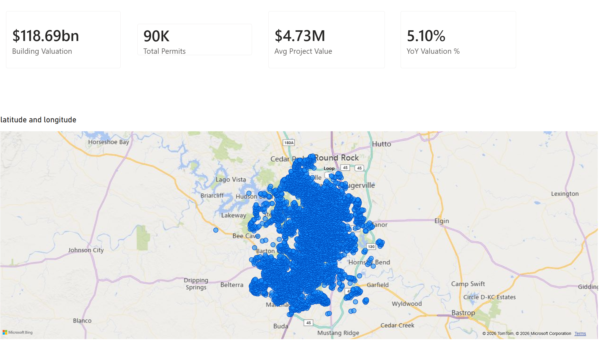
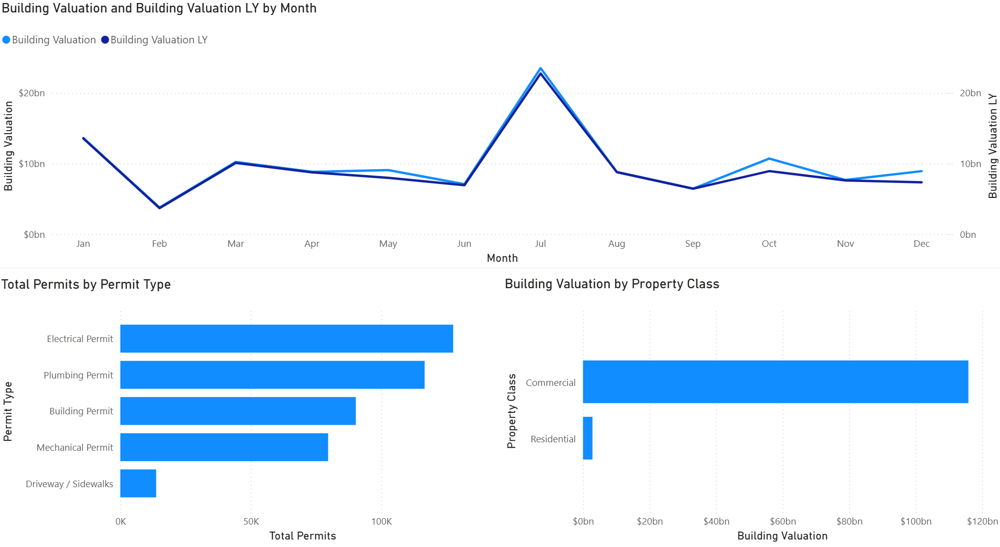
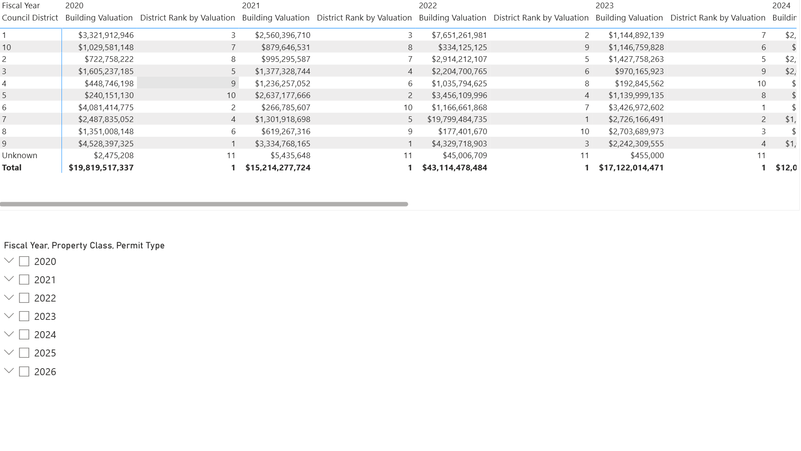
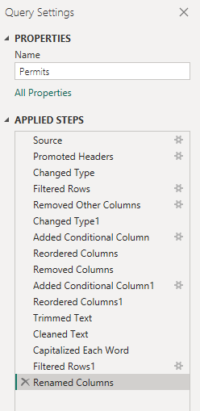

# Austin Construction Permits — Power BI Market Analysis

**An end-to-end data-analyst project:** cleaning, modeling, and analyzing 429,170 City of
Austin construction permit records (FY2020–FY2026) to answer a real business question for a
company that sells software and services to construction contractors.

> **Business question:** *Where, and in what segments, is construction activity in Austin
> growing — and which districts and project types represent the strongest market opportunity
> for a company selling to contractors?*

Every cleaning, modeling, and measure decision is documented, so the analysis is reproducible and
the conclusions are defensible. The emphasis throughout is **turning a messy public dataset into a
market decision** — not just building charts.

---

## TL;DR — the three findings

1. **The opportunity is rotating, not disappearing.** Citywide building activity has cooled since
   its FY2022 peak (building-permit volume fell from ~8,200 in FY2020 to ~800 in FY2025), but the
   *dollars are moving east.* In the latest complete-year comparison (FY2023 → FY2024), commercial
   building valuation more than doubled in **Districts 1 (+130%), 2 (+104%), 3 (+109%) and 4
   (+275%)** — Central and East Austin — while formerly-hot **Districts 6 (−94%), 8 (−79%) and 10
   (−69%)** collapsed. A market-analysis team chasing the "Austin is slowing" headline would miss
   where new contractor demand is actually forming.

2. **Sell by segment, because the money and the relationships live in different places.**
   Construction *dollars* concentrate almost entirely in **Commercial Building permits** ($116B of
   ~$119B meaningful valuation) — few projects, huge value ($170K median, $5.2M mean). Contractor
   *relationships* (repeat, day-to-day volume) live in the **~328,000 trade permits**
   (electrical / plumbing / mechanical), which are far steadier and concentrate in Districts **10,
   2, 1 and 7**. A one-size pitch leaves money on the table: high-value project tooling → commercial
   builders; volume / CRM / relationship tooling → the trades.

3. **New housing supply peaked and is contracting.** New residential units permitted fell from
   **102,425 (FY2020) to 43,687 (FY2025)** — a leading indicator that the residential-contractor
   pipeline is tightening. Commercial is where the near-term growth is.

*(Full numbers, and the data-quality decisions behind them, are below.)*

---

## The dashboard

**KPI cards + permit map (activity concentrated in the urban core, thinning toward the exurbs):**



**Trend vs. last year, permit mix, and the residential-vs-commercial dollar split:**



**District × fiscal-year matrix with dollar totals and a district rank measure** — the totals here
($19.8B in FY2020, $43.1B in FY2022, $17.1B in FY2023) reconcile exactly with the figures cited
throughout this README:



---

## The dataset

- **Source:** [Issued Construction Permits — City of Austin Open Data](https://data.austintexas.gov/dataset/Issued-Construction-Permits/3syk-w9eu)
  (dataset ID `3syk-w9eu`, free, no login).
- **Full table:** ~2.37M permits back to 1921. **This project scopes to Fiscal Year 2020+**
  via a server-side API filter → **433,669 rows** downloaded, **429,170** after cleaning.
- **Grain:** one row per issued permit. Key fields: issue date, permit type (Building / Electrical /
  Mechanical / Plumbing / Driveway-Sidewalk), residential-vs-commercial class, total job valuation,
  council district (1–10), lat/long, contractor company, fiscal year.
- **Why it's a real exercise, not a toy:** inconsistent text casing, **83% missing valuations**,
  ~30K null districts, placeholder `$1` valuations on half of building permits, and outliers up to
  **$8.1B** from data-entry errors. Handling this *is* the job.

---

## Method — five stages

### 1. Clean — Power Query
Filtered to FY2020+ first (performance), kept 17 relevant columns, fixed data types, converted
Council District to a text category (null → `Unknown`), standardized contractor names
(Trim / Clean / Capitalize), dropped VOID/Withdrawn/Cancelled statuses, and added a `Has Valuation`
flag. Every step is documented in the Applied Steps pane. Full click-by-click recipe:
**[docs/BUILD_GUIDE.md](docs/BUILD_GUIDE.md)**.



### 2. Model — Star schema
A dedicated **Date table** (Austin fiscal year starts Oct 1) marked as the date table, related
`Permits[Issue Date] → Date[Date]` (many-to-one, single direction). This is what makes the
time-intelligence DAX work and separates the model from a single flat sheet.

### 3. Measures — DAX
Real measures (not drag-and-drop sums) covering the `CALCULATE`, `DIVIDE`, time-intelligence,
`ALL`, and `RANKX` patterns interviewers look for: Total Valuation, YoY Valuation %, Total
Valuation YTD, % of Total by district, District Rank, Housing Units Added. See BUILD_GUIDE Part D.

### 4. Dashboard — Visuals
One-page report: KPI cards → district map → YoY trend line → permit-type & residential/commercial
bars → district × fiscal-year matrix, with fiscal-year / property-class / permit-type slicers.

### 5. Insight — Narrative
The three findings above, tied to a concrete targeting decision.

---

## Data-quality decisions (the analyst judgment)

These are documented on purpose — calling them out is what separates an analyst from a chart-maker.

| Issue found in the real data | Decision | Rationale |
|---|---|---|
| **83% of `Total Job Valuation` is null** (guide estimated ~50%) | Do **dollar** analysis on Building Permits only; use **counts** for the trades | Valuation is ~100% concentrated on Building Permits; trade permits rarely carry a value |
| **Half of building permits are `$0` or exactly `$1`** placeholders (26,606 rows = $1) | For dollar figures, filter `Total Job Valuation` to **$1,000 – $200,000,000** | `> 0` still includes $1 junk; the $1k floor removes placeholders (median then moves from $1 → $170K), the $200M cap removes 99 data-entry outliers up to $8.1B |
| **Residential $ is systematically understated** | Report it, but lead residential analysis with **permit counts / housing units** | Many new single-family permits are filed at the $1 placeholder |
| **~30K null council districts** | Recode null → `Unknown`, exclude from district rankings | Keeps the rows for totals without polluting geographic comparisons |
| **FY2026 is partial** (data ends 2026-07-26) | Show FY2026 but **flag it**; all YoY headlines compare complete years (FY2023 vs FY2024) | Comparing a 10-month year to a 12-month year would fabricate a decline |

---

## Key numbers

**Building valuation by fiscal year** (meaningful $, $1k–$200M):

| Fiscal Year | Building valuation | Building permits | YoY $ |
|---|---|---|---|
| FY2020 | $20.00B | 8,204 | — |
| FY2021 | $15.22B | 5,871 | −24% |
| FY2022 | $43.12B | 3,825 | +183% |
| FY2023 | $17.12B | 2,114 | −60% |
| FY2024 | $12.04B | 1,381 | −30% |
| FY2025 | $5.63B | 800 | −53% |
| FY2026 *(partial)* | $5.76B | 703 | +2% |

**District opportunity — building valuation, FY2024 vs FY2023 (complete years):**

| District | FY2023 | FY2024 | YoY |
|---|---|---|---|
| 2 | $1.43B | $2.91B | **+104%** |
| 1 | $1.14B | $2.63B | **+130%** |
| 3 | $970M | $2.02B | **+109%** |
| 4 | $193M | $724M | **+275%** |
| 7 | $2.73B | $1.28B | −53% |
| 9 | $2.24B | $1.01B | −55% |
| 8 | $2.70B | $555M | −79% |
| 10 | $1.15B | $353M | −69% |
| 5 | $1.14B | $327M | −71% |
| 6 | $3.43B | $221M | −94% |

*(District 9 ≈ downtown/UT. The growth cluster 1-2-3-4 is Central/East Austin.)*

---

## Repo structure

```
austin-permits-powerbi/
├── README.md                  ← you are here (the portfolio write-up)
├── data/
│   ├── permits_clean_sample.csv  ← 5,000-row sample of the cleaned data (committed)
│   ├── permits_raw.csv           ← raw FY2020+ API pull, 433,669 rows  [git-ignored, regenerable]
│   ├── permits_clean.csv         ← full cleaned output, 429,170 rows   [git-ignored, regenerable]
│   └── README.md                 ← how to regenerate the full datasets
├── docs/
│   ├── BUILD_GUIDE.md         ← exact Power BI build steps (Power Query + DAX + visuals)
│   ├── RESUME.md              ← resume bullets + interview talking points
│   ├── final_insights.txt     ← raw analysis output
│   └── profiling_report.txt   ← data-quality profiling output
├── scripts/
│   ├── profile_and_clean.py   ← Python mirror of the Power Query cleaning (repro + validation)
│   └── final_insights.py      ← computes the findings above from the cleaned data
├── screenshots/               ← Applied Steps + dashboard visuals (embedded above)
└── AustinPermits.pbix         ← the Power BI file (built with BUILD_GUIDE.md)
```

> The Python scripts reproduce and validate the Power BI cleaning logic against the real column
> names, so the numbers in this README are the *actual* data — not placeholders. The Power BI
> file is where the interactive dashboard lives.

## Reproduce

```bash
# 1. Pull the raw data (server-side filtered to FY2020+)
#    (or use Power BI's Web connector — see BUILD_GUIDE Part A)
python scripts/profile_and_clean.py      # -> data/permits_clean.csv + profiling
python scripts/final_insights.py         # -> the findings table
```

---

## Contact

**Ryder Fiechter** · [LinkedIn](https://www.linkedin.com/in/ryder-fiechter-481527229)
